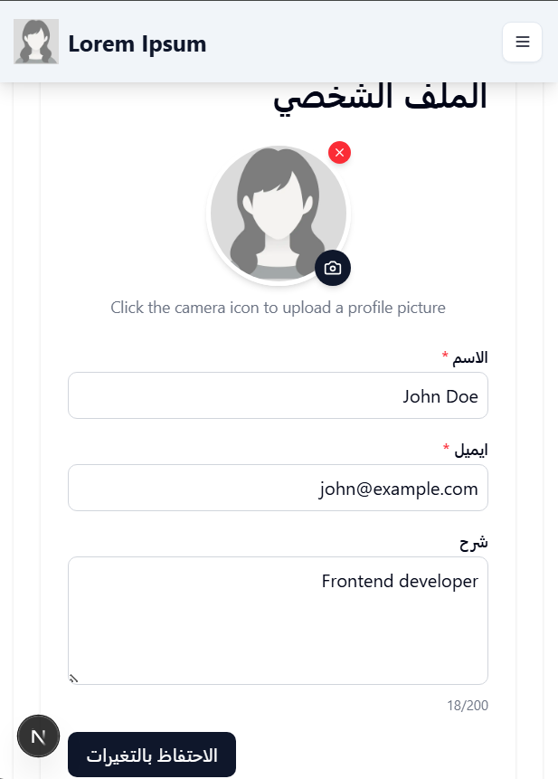
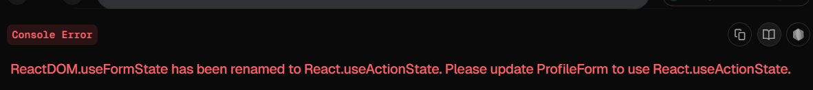

This is a [Next.js](https://nextjs.org) project bootstrapped with [`create-next-app`](https://nextjs.org/docs/app/api-reference/cli/create-next-app).

A modern user profile form with server-side rendering, form validation, and internationalization support built with Next.js App Router.

## Features

- **Server-Side Rendered Form**
  - Initial data loading from mock API
  - Loading states with skeleton UI
- **Robust Validation**
  - Zod schema validation (server-side)
  - Client-side validation with custom error messages
  - Field requirements:
    - Name (required, min 2 chars)
    - Email (required, valid format)
    - Bio (optional, max 200 chars)
- **Form Handling**
  - Server Actions for form submission
  - Optimistic UI updates
  - Toast notifications for success/error states
- **Internationalization**
  - Support for multiple languages (English/Arabic)
  - Right-to-left (RTL) layout support
- **Bonus Features**
  - Profile picture upload (mock implementation)
  - Responsive design with Tailwind CSS
  - Reusable form components

## Technologies Used

- [Next.js](https://nextjs.org/) (App Router)
- [React](https://react.dev/)
- [TypeScript](https://www.typescriptlang.org/)
- [Tailwind CSS](https://tailwindcss.com/)
- [Zod](https://zod.dev/) (Validation)
- [Lucide React](https://lucide.dev/) (Icons)
- [Sonner](https://sonner.emilkowal.ski/) (Toasts)
- [Vitest](https://vitest.dev/) (Testing)

## Getting Started

First, run the development server:

```bash
npm run dev
# or
yarn dev
# or
pnpm dev
# or
bun dev
```

## Constraints

Couldn't use UseFormState since it was deprecated, had to use UseActionState

Open [http://localhost:3000](http://localhost:3000) with your browser to see the result.

You can start editing the page by modifying `app/page.tsx`. The page auto-updates as you edit the file.

This project uses [`next/font`](https://nextjs.org/docs/app/building-your-application/optimizing/fonts) to automatically optimize and load [Geist](https://vercel.com/font), a new font family for Vercel.

## Testing

npm test

# or

yarn test

## Learn More

To learn more about Next.js, take a look at the following resources:

- [Next.js Documentation](https://nextjs.org/docs) - learn about Next.js features and API.
- [Learn Next.js](https://nextjs.org/learn) - an interactive Next.js tutorial.

You can check out [the Next.js GitHub repository](https://github.com/vercel/next.js) - your feedback and contributions are welcome!

## Deploy on Vercel

The easiest way to deploy your Next.js app is to use the [Vercel Platform](https://vercel.com/new?utm_medium=default-template&filter=next.js&utm_source=create-next-app&utm_campaign=create-next-app-readme) from the creators of Next.js.

Check out our [Next.js deployment documentation](https://nextjs.org/docs/app/building-your-application/deploying) for more details.
